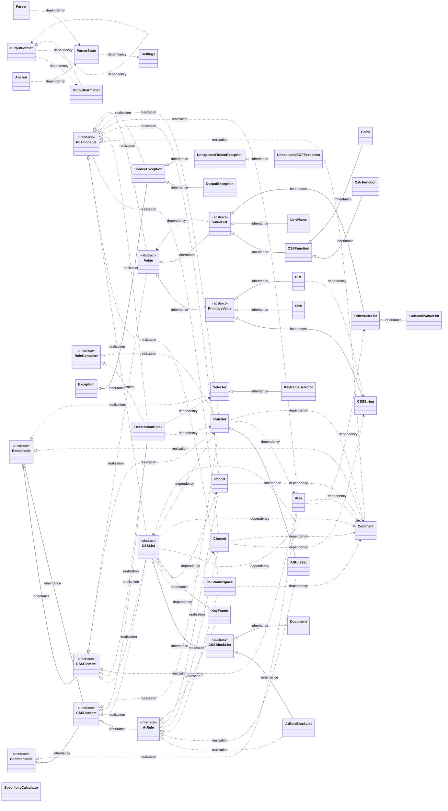

# PHP CSS Parser

[](https://github.com/MyIntervals/PHP-CSS-Parser/actions/)
[](https://coveralls.io/github/MyIntervals/PHP-CSS-Parser?branch=main)

A Parser for CSS Files written in PHP. Allows extraction of CSS files into a data structure, manipulation of said structure and output as (optimized) CSS.

## Usage

### Installation using Composer

```bash
composer require sabberworm/php-css-parser
```

### Extraction

To use the CSS Parser, create a new instance. The constructor takes the following form:

```php
new \Sabberworm\CSS\Parser($css);
```

To read a file, for example, you’d do the following:

```php
$parser = new \Sabberworm\CSS\Parser(file_get_contents('somefile.css'));
$cssDocument = $parser->parse();
```

The resulting CSS document structure can be manipulated prior to being output.

### Options

#### Charset

The charset option will only be used if the CSS file does not contain an `@charset` declaration. UTF-8 is the default, so you won’t have to create a settings object at all if you don’t intend to change that.

```php
$settings = \Sabberworm\CSS\Settings::create()
    ->withDefaultCharset('windows-1252');
$parser = new \Sabberworm\CSS\Parser($css, $settings);
```

#### Strict parsing

To have the parser throw an exception when encountering invalid/unknown constructs (as opposed to trying to ignore them and carry on parsing), supply a thusly configured `\Sabberworm\CSS\Settings` object:

```php
$parser = new \Sabberworm\CSS\Parser(
    file_get_contents('somefile.css'),
    \Sabberworm\CSS\Settings::create()->beStrict()
);
```

Note that this will also disable a workaround for parsing the unquoted variant of the legacy IE-specific `filter` rule.

#### Disable multibyte functions

To achieve faster parsing, you can choose to have PHP-CSS-Parser use regular string functions instead of `mb_*` functions. This should work fine in most cases, even for UTF-8 files, as all the multibyte characters are in string literals. Still it’s not recommended using this with input you have no control over as it’s not thoroughly covered by test cases.

```php
$settings = \Sabberworm\CSS\Settings::create()->withMultibyteSupport(false);
$parser = new \Sabberworm\CSS\Parser($css, $settings);
```

### Manipulation

The resulting data structure consists mainly of five basic types: `CSSList`, `RuleSet`, `Rule`, `Selector` and `Value`. There are two additional types used: `Import` and `Charset`, which you won’t use often.

#### CSSList

`CSSList` represents a generic CSS container, most likely containing declaration blocks (rule sets with a selector), but it may also contain at-rules, charset declarations, etc.

To access the items stored in a `CSSList` – like the document you got back when calling `$parser->parse()` –, use `getContents()`, then iterate over that collection and use `instanceof` to check whether you’re dealing with another `CSSList`, a `RuleSet`, a `Import` or a `Charset`.

To append a new item (selector, media query, etc.) to an existing `CSSList`, construct it using the constructor for this class and use the `append($oItem)` method.

#### RuleSet

`RuleSet` is a container for individual rules. The most common form of a rule set is one constrained by a selector. The following concrete subtypes exist:

* `AtRuleSet` – for generic at-rules for generic at-rules which are not covered by specific classes, i.e., not `@import`, `@charset` or `@media`. A common example for this is `@font-face`.
* `DeclarationBlock` – a `RuleSet` constrained by a `Selector`; contains an array of selector objects (comma-separated in the CSS) as well as the rules to be applied to the matching elements.

Note: A `CSSList` can contain other `CSSList`s (and `Import`s as well as a `Charset`), while a `RuleSet` can only contain `Rule`s.

If you want to manipulate a `RuleSet`, use the methods `addRule(Rule $rule)`, `getRules()` and `removeRule($rule)` (which accepts either a `Rule` or a rule name; optionally suffixed by a dash to remove all related rules).

#### Rule

`Rule`s just have a string key (the rule) and a `Value`.

#### Value

`Value` is an abstract class that only defines the `render` method. The concrete subclasses for atomic value types are:

* `Size` – consists of a numeric `size` value and a unit.
* `Color` – colors can be input in the form #rrggbb, #rgb or schema(val1, val2, …) but are always stored as an array of ('s' => val1, 'c' => val2, 'h' => val3, …) and output in the second form.
* `CSSString` – this is just a wrapper for quoted strings to distinguish them from keywords; always output with double quotes.
* `URL` – URLs in CSS; always output in `URL("")` notation.

There is another abstract subclass of `Value`, `ValueList`: A `ValueList` represents a lists of `Value`s, separated by some separation character (mostly `,`, whitespace, or `/`).

There are two types of `ValueList`s:

* `RuleValueList` – The default type, used to represent all multivalued rules like `font: bold 12px/3 Helvetica, Verdana, sans-serif;` (where the value would be a whitespace-separated list of the primitive value `bold`, a slash-separated list and a comma-separated list).
* `CSSFunction` – A special kind of value that also contains a function name and where the values are the function’s arguments. Also handles equals-sign-separated argument lists like `filter: alpha(opacity=90);`.

#### Convenience methods

There are a few convenience methods on `Document` to ease finding, manipulating and deleting rules:

* `getAllDeclarationBlocks()` – does what it says; no matter how deeply nested the selectors are. Aliased as `getAllSelectors()`.
* `getAllRuleSets()` – does what it says; no matter how deeply nested the rule sets are.
* `getAllValues()` – finds all `Value` objects inside `Rule`s.

## To-Do

* More convenience methods (like `selectorsWithElement($sId/Class/TagName)`, `attributesOfType($type)`, `removeAttributesOfType($type)`)
* Real multibyte support. Currently, only multibyte charsets whose first 255 code points take up only one byte and are identical with ASCII are supported (yes, UTF-8 fits this description).
* Named color support (using `Color` instead of an anonymous string literal)

## Use cases

### Use `Parser` to prepend an ID to all selectors

```php
$myId = "#my_id";
$parser = new \Sabberworm\CSS\Parser($css);
$cssDocument = $parser->parse();
foreach ($cssDocument->getAllDeclarationBlocks() as $block) {
    foreach ($block->getSelectors() as $selector) {
        // Loop over all selector parts (the comma-separated strings in a
        // selector) and prepend the ID.
        $selector->setSelector($myId.' '.$selector->getSelector());
    }
}
```

### Shrink all absolute sizes to half

```php
$parser = new \Sabberworm\CSS\Parser($css);
$cssDocument = $parser->parse();
foreach ($cssDocument->getAllValues() as $value) {
    if ($value instanceof CSSSize && !$value->isRelative()) {
        $value->setSize($value->getSize() / 2);
    }
}
```

### Remove unwanted rules

```php
$parser = new \Sabberworm\CSS\Parser($css);
$cssDocument = $parser->parse();
foreach($cssDocument->getAllRuleSets() as $oRuleSet) {
    // Note that the added dash will make this remove all rules starting with
    // `font-` (like `font-size`, `font-weight`, etc.) as well as a potential
    // `font` rule.
    $oRuleSet->removeRule('font-');
    $oRuleSet->removeRule('cursor');
}
```

### Output

To output the entire CSS document into a variable, just use `->render()`:

```php
$parser = new \Sabberworm\CSS\Parser(file_get_contents('somefile.css'));
$cssDocument = $parser->parse();
print $cssDocument->render();
```

If you want to format the output, pass an instance of type `\Sabberworm\CSS\OutputFormat`:

```php
$format = \Sabberworm\CSS\OutputFormat::create()
    ->indentWithSpaces(4)->setSpaceBetweenRules("\n");
print $cssDocument->render($format);
```

Or use one of the predefined formats:

```php
print $cssDocument->render(Sabberworm\CSS\OutputFormat::createPretty());
print $cssDocument->render(Sabberworm\CSS\OutputFormat::createCompact());
```

To see what you can do with output formatting, look at the tests in `tests/OutputFormatTest.php`.

## Examples

### Example 1 (At-Rules)

#### Input

```css
@charset "utf-8";

@font-face {
  font-family: "CrassRoots";
  src: url("../media/cr.ttf");
}

html, body {
    font-size: 1.6em;
}

@keyframes mymove {
    from { top: 0px; }
    to { top: 200px; }
}

```

<details>
  <summary><b>Structure (<code>var_dump()</code>)</b></summary>

```php
class Sabberworm\CSS\CSSList\Document#4 (2) {
  protected $contents =>
  array(4) {
    [0] =>
    class Sabberworm\CSS\Property\Charset#6 (2) {
      private $charset =>
      class Sabberworm\CSS\Value\CSSString#5 (2) {
        private $string =>
        string(5) "utf-8"
        protected $lineNumber =>
        int(1)
      }
      protected $lineNumber =>
      int(1)
    }
    [1] =>
    class Sabberworm\CSS\RuleSet\AtRuleSet#7 (4) {
      private $type =>
      string(9) "font-face"
      private $arguments =>
      string(0) ""
      private $rules =>
      array(2) {
        'font-family' =>
        array(1) {
          [0] =>
          class Sabberworm\CSS\Rule\Rule#8 (4) {
            private $rule =>
            string(11) "font-family"
            private $value =>
            class Sabberworm\CSS\Value\CSSString#9 (2) {
              private $string =>
              string(10) "CrassRoots"
              protected $lineNumber =>
              int(4)
            }
            private $isImportant =>
            bool(false)
            protected $lineNumber =>
            int(4)
          }
        }
        'src' =>
        array(1) {
          [0] =>
          class Sabberworm\CSS\Rule\Rule#10 (4) {
            private $rule =>
            string(3) "src"
            private $value =>
            class Sabberworm\CSS\Value\URL#11 (2) {
              private $url =>
              class Sabberworm\CSS\Value\CSSString#12 (2) {
                private $string =>
                string(15) "../media/cr.ttf"
                protected $lineNumber =>
                int(5)
              }
              protected $lineNumber =>
              int(5)
            }
            private $isImportant =>
            bool(false)
            protected $lineNumber =>
            int(5)
          }
        }
      }
      protected $lineNumber =>
      int(3)
    }
    [2] =>
    class Sabberworm\CSS\RuleSet\DeclarationBlock#13 (3) {
      private $selectors =>
      array(2) {
        [0] =>
        class Sabberworm\CSS\Property\Selector#14 (2) {
          private $selector =>
          string(4) "html"
          private $specificity =>
          NULL
        }
        [1] =>
        class Sabberworm\CSS\Property\Selector#15 (2) {
          private $selector =>
          string(4) "body"
          private $specificity =>
          NULL
        }
      }
      private $rules =>
      array(1) {
        'font-size' =>
        array(1) {
          [0] =>
          class Sabberworm\CSS\Rule\Rule#16 (4) {
            private $rule =>
            string(9) "font-size"
            private $value =>
            class Sabberworm\CSS\Value\Size#17 (4) {
              private $size =>
              double(1.6)
              private $unit =>
              string(2) "em"
              private $isColorComponent =>
              bool(false)
              protected $lineNumber =>
              int(9)
            }
            private $isImportant =>
            bool(false)
            protected $lineNumber =>
            int(9)
          }
        }
      }
      protected $lineNumber =>
      int(8)
    }
    [3] =>
    class Sabberworm\CSS\CSSList\KeyFrame#18 (4) {
      private $vendorKeyFrame =>
      string(9) "keyframes"
      private $animationName =>
      string(6) "mymove"
      protected $contents =>
      array(2) {
        [0] =>
        class Sabberworm\CSS\RuleSet\DeclarationBlock#19 (3) {
          private $selectors =>
          array(1) {
            [0] =>
            class Sabberworm\CSS\Property\Selector#20 (2) {
              private $selector =>
              string(4) "from"
              private $specificity =>
              NULL
            }
          }
          private $rules =>
          array(1) {
            'top' =>
            array(1) {
              [0] =>
              class Sabberworm\CSS\Rule\Rule#21 (4) {
                private $rule =>
                string(3) "top"
                private $value =>
                class Sabberworm\CSS\Value\Size#22 (4) {
                  private $size =>
                  double(0)
                  private $unit =>
                  string(2) "px"
                  private $isColorComponent =>
                  bool(false)
                  protected $lineNumber =>
                  int(13)
                }
                private $isImportant =>
                bool(false)
                protected $lineNumber =>
                int(13)
              }
            }
          }
          protected $lineNumber =>
          int(13)
        }
        [1] =>
        class Sabberworm\CSS\RuleSet\DeclarationBlock#23 (3) {
          private $selectors =>
          array(1) {
            [0] =>
            class Sabberworm\CSS\Property\Selector#24 (2) {
              private $selector =>
              string(2) "to"
              private $specificity =>
              NULL
            }
          }
          private $rules =>
          array(1) {
            'top' =>
            array(1) {
              [0] =>
              class Sabberworm\CSS\Rule\Rule#25 (4) {
                private $rule =>
                string(3) "top"
                private $value =>
                class Sabberworm\CSS\Value\Size#26 (4) {
                  private $size =>
                  double(200)
                  private $unit =>
                  string(2) "px"
                  private $isColorComponent =>
                  bool(false)
                  protected $lineNumber =>
                  int(14)
                }
                private $isImportant =>
                bool(false)
                protected $lineNumber =>
                int(14)
              }
            }
          }
          protected $lineNumber =>
          int(14)
        }
      }
      protected $lineNumber =>
      int(12)
    }
  }
  protected $lineNumber =>
  int(1)
}

```
</details>

#### Output (`render()`)

```css
@charset "utf-8";
@font-face {font-family: "CrassRoots";src: url("../media/cr.ttf");}
html, body {font-size: 1.6em;}
@keyframes mymove {from {top: 0px;} to {top: 200px;}}
```

### Example 2 (Values)

#### Input

```css
#header {
    margin: 10px 2em 1cm 2%;
    font-family: Verdana, Helvetica, "Gill Sans", sans-serif;
    color: red !important;
}

```

<details>
  <summary><b>Structure (<code>var_dump()</code>)</b></summary>

```php
class Sabberworm\CSS\CSSList\Document#4 (2) {
  protected $contents =>
  array(1) {
    [0] =>
    class Sabberworm\CSS\RuleSet\DeclarationBlock#5 (3) {
      private $selectors =>
      array(1) {
        [0] =>
        class Sabberworm\CSS\Property\Selector#6 (2) {
          private $selector =>
          string(7) "#header"
          private $specificity =>
          NULL
        }
      }
      private $rules =>
      array(3) {
        'margin' =>
        array(1) {
          [0] =>
          class Sabberworm\CSS\Rule\Rule#7 (4) {
            private $rule =>
            string(6) "margin"
            private $value =>
            class Sabberworm\CSS\Value\RuleValueList#12 (3) {
              protected $components =>
              array(4) {
                [0] =>
                class Sabberworm\CSS\Value\Size#8 (4) {
                  private $size =>
                  double(10)
                  private $unit =>
                  string(2) "px"
                  private $isColorComponent =>
                  bool(false)
                  protected $lineNumber =>
                  int(2)
                }
                [1] =>
                class Sabberworm\CSS\Value\Size#9 (4) {
                  private $size =>
                  double(2)
                  private $unit =>
                  string(2) "em"
                  private $isColorComponent =>
                  bool(false)
                  protected $lineNumber =>
                  int(2)
                }
                [2] =>
                class Sabberworm\CSS\Value\Size#10 (4) {
                  private $size =>
                  double(1)
                  private $unit =>
                  string(2) "cm"
                  private $isColorComponent =>
                  bool(false)
                  protected $lineNumber =>
                  int(2)
                }
                [3] =>
                class Sabberworm\CSS\Value\Size#11 (4) {
                  private $size =>
                  double(2)
                  private $unit =>
                  string(1) "%"
                  private $isColorComponent =>
                  bool(false)
                  protected $lineNumber =>
                  int(2)
                }
              }
              protected $separator =>
              string(1) " "
              protected $lineNumber =>
              int(2)
            }
            private $isImportant =>
            bool(false)
            protected $lineNumber =>
            int(2)
          }
        }
        'font-family' =>
        array(1) {
          [0] =>
          class Sabberworm\CSS\Rule\Rule#13 (4) {
            private $rule =>
            string(11) "font-family"
            private $value =>
            class Sabberworm\CSS\Value\RuleValueList#15 (3) {
              protected $components =>
              array(4) {
                [0] =>
                string(7) "Verdana"
                [1] =>
                string(9) "Helvetica"
                [2] =>
                class Sabberworm\CSS\Value\CSSString#14 (2) {
                  private $string =>
                  string(9) "Gill Sans"
                  protected $lineNumber =>
                  int(3)
                }
                [3] =>
                string(10) "sans-serif"
              }
              protected $sSeparator =>
              string(1) ","
              protected $lineNumber =>
              int(3)
            }
            private $isImportant =>
            bool(false)
            protected $lineNumber =>
            int(3)
          }
        }
        'color' =>
        array(1) {
          [0] =>
          class Sabberworm\CSS\Rule\Rule#16 (4) {
            private $rule =>
            string(5) "color"
            private $value =>
            string(3) "red"
            private $isImportant =>
            bool(true)
            protected $lineNumber =>
            int(4)
          }
        }
      }
      protected $lineNumber =>
      int(1)
    }
  }
  protected $lineNumber =>
  int(1)
}

```
</details>

#### Output (`render()`)

```css
#header {margin: 10px 2em 1cm 2%;font-family: Verdana,Helvetica,"Gill Sans",sans-serif;color: red !important;}
```

## Class diagram



## API and deprecation policy

Please have a look at our
[API and deprecation policy](docs/API-and-deprecation-policy.md).

## Contributing

Contributions in the form of bug reports, feature requests, or pull requests are
more than welcome. :pray: Please have a look at our
[contribution guidelines](CONTRIBUTING.md) to learn more about how to
contribute to PHP-CSS-Parser.

## Contributors/Thanks to

* [oliverklee](https://github.com/oliverklee) for lots of refactorings, code modernizations and CI integrations
* [raxbg](https://github.com/raxbg) for contributions to parse `calc`, grid lines, and various bugfixes.
* [westonruter](https://github.com/westonruter) for bugfixes and improvements.
* [FMCorz](https://github.com/FMCorz) for many patches and suggestions, for being able to parse comments and IE hacks (in lenient mode).
* [Lullabot](https://github.com/Lullabot) for a patch that allows to know the line number for each parsed token.
* [ju1ius](https://github.com/ju1ius) for the specificity parsing code and the ability to expand/compact shorthand properties.
* [ossinkine](https://github.com/ossinkine) for a 150 time performance boost.
* [GaryJones](https://github.com/GaryJones) for lots of input and [https://css-specificity.info/](https://css-specificity.info/).
* [docteurklein](https://github.com/docteurklein) for output formatting and `CSSList->remove()` inspiration.
* [nicolopignatelli](https://github.com/nicolopignatelli) for PSR-0 compatibility.
* [diegoembarcadero](https://github.com/diegoembarcadero) for keyframe at-rule parsing.
* [goetas](https://github.com/goetas) for `@namespace` at-rule support.
* [ziegenberg](https://github.com/ziegenberg) for general housekeeping and cleanup.
* [View full list](https://github.com/sabberworm/PHP-CSS-Parser/contributors)

## Misc

### Legacy Support

The latest pre-PSR-0 version of this project can be checked with the `0.9.0` tag.
